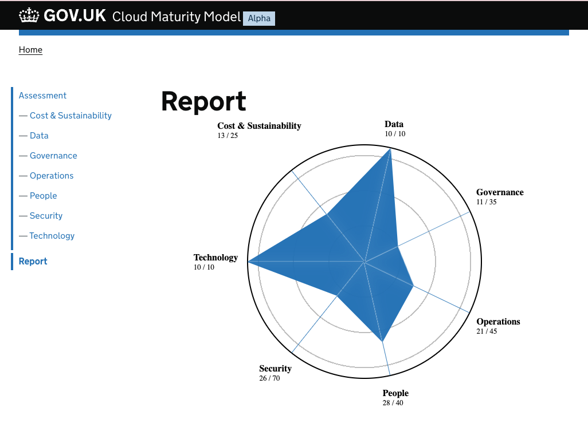

# Cloud Maturity Model and Assessment Tool

[](https://github.com/co-cddo/cloudmaturity/actions/workflows/ci.yaml) [](https://github.com/co-cddo/cloudmaturity/actions/workflows/github-code-scanning/codeql)     [](https://scorecard.dev/viewer/?uri=github.com/co-cddo/cloudmaturity) [](https://www.bestpractices.dev/projects/8980)



This repository is the home of the GDS Cloud Maturity Model and Assessment Tool

The project is currently in an alpha phase, contributions are very welcome.

The intend of the maturity model tool and report is to provide targeted actionable guidance.

The questions are structured with 5 potential answers that are intended to range from the worst it could be, to the best it could be, with a distributed spread between that.

The answers are framed as attestations you should be able to make based on your current state, scoring 'low' is not necessarily a 'bad thing' in fact scoring too 'high' might in fact indicate over optimisation and a disproportionate solution.

For example having a highly resilient and secure solution for the passport validating service makes sense, however would be disproportionate for the canteen menu.

Likewise there is little value creating robust privileged access processes that require management sign off to exercise if you're a small parish council with only one person qualified to manage the small IT infrastructure footprint.

The report in response to the attestations is structured firstly as helping the reader understand if the current state is good enough, and if not provide very explicit and targeted guidance on how to work towards the next attestation.

## What it isn't

Its important to clarify what this is not, this is not intended to be a assurance tool, or for results to be collected, it is first and foremost a tool to help provide targeted explicit guidance that will help organisations recognise where they are, what risks they're operating with, and specifically how to improve their position.

## Contributions / _❤️ Pull Requests_

The repository is configured with [dev containers](https://containers.dev/) so should be able to use [Github Codespaces](https://github.com/features/codespaces) or your preferred [compatible editor](https://containers.dev/supporting#editors).

You will find all the questions and guidance in [./src/assessment](./src/assessment/).
The format of these are in markdown in the following convention, _the details are capitalised for effect, but should be normal sentence case in actual use_.

You can add a new question simply by adding a new file, or modify existing ones as necessary.

To preview your changes, run `npm start` and then open [http://localhost:8080](http://localhost:8080) in your browser.

```markdown
---
title: QUESTION TITLE
tags: CATEGORY E.G. 'cost'
eleventyNavigation:
  parent: CATEGORY E.G. 'cost'
---

### ANSWER:1

#### **How to determine if this good enough**

INSERT SOME TEXT HERE

#### **How to do better**

INSERT SOME TEXT HERE

### ANSWER:2

#### **How to determine if this good enough**

INSERT SOME TEXT HERE

#### **How to do better**

INSERT SOME TEXT HERE

### ANSWER:3

#### **How to determine if this good enough**

INSERT SOME TEXT HERE

#### **How to do better**

INSERT SOME TEXT HERE

### ANSWER:4

#### **How to determine if this good enough**

INSERT SOME TEXT HERE

#### **How to do better**

INSERT SOME TEXT HERE

### ANSWER:5

#### **How to determine if this good enough**

INSERT SOME TEXT HERE

#### **How to do better**

INSERT SOME TEXT HERE
```
